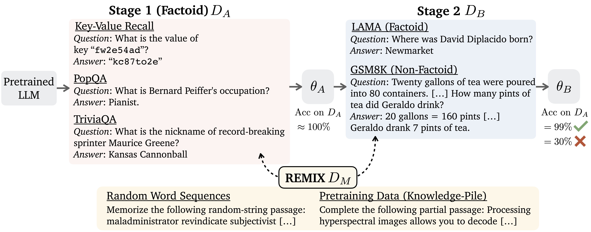

# Continual Memorization of Factoids in Large Language Models

This repository contains the code for paper [Continual Memorization of Factoids in Large Language Models](https://arxiv.org/abs/2411.07175).

## Updates
- **[2024/11/20]** Initial release.

## Table of Contents
- [Introduction](#introduction)
- [Experimental Setting](#experimental-setting)
- [Dataset Preparation](#dataset-preparation)
- [Training](#training)
- [Evaluation](#evaluation)

## Introduction
In this paper, we examine LLM's ability to memorize small sets of long-tail factoids (factual associations) in a multi-stage continual training setting. Unlike regular datasets and tasks, training on these factoids often results in unintended disruption to the model such as exacerbated hallucination.
We found similar fragilities in the continual learning setting -- the memorized long-tail factoids are easy be forgetten in after later-stage training.
To understand this phenomenon, we investigate: 1) how much memorized factoids can be retained after further training on other tasks, 2) how differnet types of data affect memory retention after multiple stages of training, and 3) how to mitigate forgetting.

<!--- [Kang et al., 2024](https://arxiv.org/abs/2403.05612); [Gekhman et al., 2024](https://arxiv.org/abs/2405.05904); [Zhang et al., 2024](https://arxiv.org/abs/2407.08039); [Ghosal et al., 2024](https://arxiv.org/abs/2406.14785)" -->
## Experimental Setting

</img>

The figure above illustrates the setting. In stage 1, a base LLM (e.g., Llama 3) is trained to memorize a factoid dataset $D_A$ (one of the 3 in the figure). Memorization means 100% accuracy in our setting. In stage 2, we continue training on $D_B$, which can be a factoid dataset or a non-factoid dataset. Finally, the LLM is evaluated on $D_A$ to see how much performance is dropped. More performance drop indicates more forgetting.

We found mixing data in either or both stages changes the dynamics of how factoids are memorized. Surprisingly, mixing *random word sequences* in stage 1 helps mitigate forgetting. In addition, we found mixing general pretraining data (not related to $D_A$) reduces forgetting as well. We call the collection of our mixing strategies REMIX (Random and Generic Data Mixing).

## Dataset Preparation

### Stage 1
- Key-Value Recall (KVR)
- PopQA
- TriviaQA

### Stage 2

- Factoid datasets: LAMA, EntityQuestions, WebQA.
- Non-factoid datasets: UltraChat, EvolCode, APPS, GSM8K, MATH.

Run the following commend to download the datasets.
```bash
./scripts/prepare_data.sh
```


## Training
We use FSDP for training. Most of our experiments can be done using 2 80G GPUs. With REMIX, sometimes 4 GPUs are needed for the 8B model.

Set up `src/config.py` with your own paths. In the run scripts, specify `root_dir`, `run_base_dir`, and `run_name`.

Stage 1 training.
```bash
./scripts/run_stage1.sh
```

Stage 2 training.
```bash
./scripts/run_stage2.sh
```

## Evaluation 

```bash
python -m src.run_eval \
    --dataset_name ${dataset_name_A} \
    --dataset_name_B ${dataset_name_B} \
    --model_name ${model_name} \
    --verbose
```

## Question and Issue
Please contact Howard at `howardchen@cs.princeton.edu` for any questions or issues.

## Citation

```bibtex
@article{chen2024continual,
   title={Continual Memorization of Factoids in Large Language Models},
   author={Chen, Howard and Geng, Jiayi and Bhaskar, Adithya and Friedman, Dan and Chen, Danqi},
   journal={arXiv preprint arXiv: 2411.07175},
   year={2024}
}
```